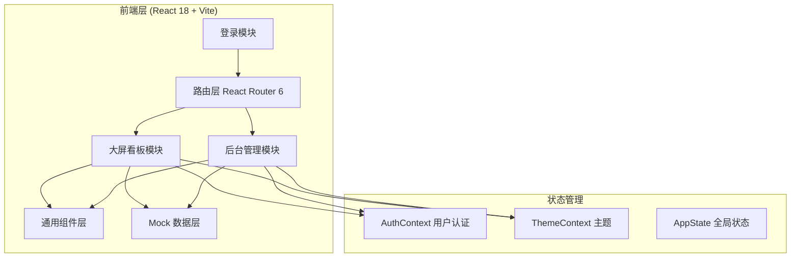
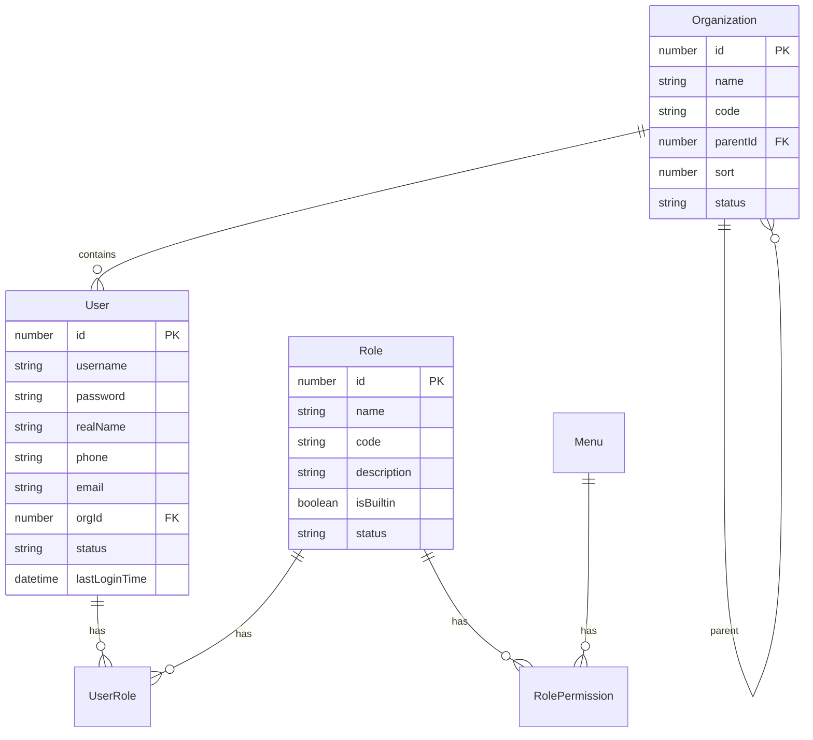
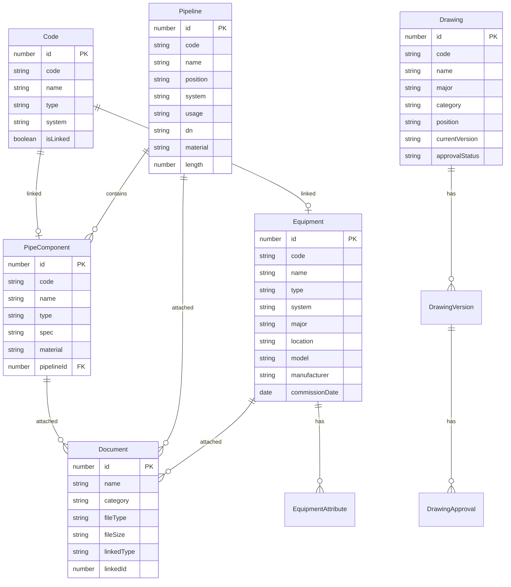

# 乌江渡水电站数字孪生管理平台 技术架构文档

## 1. 架构设计



## 2. 技术说明

- **前端框架**：React@18 + Vite@5
- **UI 组件库**：Ant Design@5
- **路由**：React Router@6
- **状态管理**：Context API + useState（原型规模，无需 Redux）
- **样式方案**：Tailwind CSS@3 + CSS Modules
- **图表库**：ECharts@5（饼图、柱状图）
- **图标**：@ant-design/icons
- **初始化工具**：vite-init
- **后端**：无（原型全部 Mock 数据）
- **数据库**：无（使用本地 Mock JSON 数据）

## 3. 路由定义

| 路由 | 用途 |
|------|------|
| `/login` | 登录页面 |
| `/screen` | 大屏看板（默认页） |
| `/admin` | 后台管理布局（含左导航+顶栏） |
| `/admin/dashboard` | 工作台 |
| `/admin/drawing` | 图纸列表 |
| `/admin/drawing/detail/:id` | 图纸详情 |
| `/admin/equipment` | 设备管理 |
| `/admin/equipment/detail/:id` | 设备详情 |
| `/admin/equipment/attribute` | 属性资料 |
| `/admin/equipment/code` | 编码管理 |
| `/admin/equipment/bim` | BIM 驾驶舱 |
| `/admin/pipeline/tree` | 管路结构树 |
| `/admin/pipeline/category` | 管路分类管理 |
| `/admin/pipeline/category/detail/:id` | 管路详情 |
| `/admin/pipeline/attribute` | 属性管理 |
| `/admin/pipeline/valve` | 阀门管理 |
| `/admin/pipeline/valve/detail/:id` | 阀门详情 |
| `/admin/document` | 资料列表 |
| `/admin/system/org` | 组织机构 |
| `/admin/system/role` | 角色管理 |
| `/admin/system/user` | 用户管理 |
| `/admin/system/dict` | 数据字典 |
| `/admin/system/workflow` | 工作流管理 |
| `/admin/system/workflow/designer/:id` | 工作流设计器 |
| `/admin/system/log` | 日志查询 |

## 4. 目录结构

```
src/
├── main.jsx                    # 应用入口
├── App.jsx                     # 根组件 + 路由配置
├── index.css                   # 全局样式
├── contexts/
│   ├── AuthContext.jsx         # 用户认证上下文
│   └── ThemeContext.jsx        # 主题上下文
├── layouts/
│   ├── ScreenLayout.jsx        # 大屏看板布局
│   └── AdminLayout.jsx         # 后台管理布局
├── components/
│   ├── common/                 # 通用组件
│   │   ├── SearchForm.jsx
│   │   ├── DataTable.jsx
│   │   ├── Modal.jsx
│   │   ├── UploadBox.jsx
│   │   └── TreePanel.jsx
│   └── screen/                 # 大屏专用组件
│       ├── TopNav.jsx
│       ├── LeftTreePanel.jsx
│       ├── RightInfoPanel.jsx
│       ├── Scene3D.jsx
│       ├── BottomBar.jsx
│       └── RoamingPanel.jsx
├── pages/
│   ├── Login.jsx
│   ├── screen/
│   │   └── index.jsx
│   ├── dashboard/
│   │   └── index.jsx
│   ├── drawing/
│   │   ├── List.jsx
│   │   ├── Detail.jsx
│   │   └── components/
│   ├── equipment/
│   │   ├── List.jsx
│   │   ├── Detail.jsx
│   │   ├── Attribute.jsx
│   │   ├── Code.jsx
│   │   └── Bim.jsx
│   ├── pipeline/
│   │   ├── Tree.jsx
│   │   ├── Category.jsx
│   │   ├── Attribute.jsx
│   │   ├── Valve.jsx
│   │   └── detail/
│   ├── document/
│   │   └── List.jsx
│   └── system/
│       ├── Org.jsx
│       ├── Role.jsx
│       ├── User.jsx
│       ├── Dict.jsx
│       ├── Workflow.jsx
│       ├── WorkflowDesigner.jsx
│       └── Log.jsx
└── mock/
    ├── user.js
    ├── equipment.js
    ├── pipeline.js
    ├── drawing.js
    └── ...
```

## 5. 数据模型

### 5.1 用户与权限模型



### 5.2 业务数据模型



## 6. 关键技术实现

### 6.1 大屏看板 3D 场景模拟

由于原型阶段无真实 UE5 像素流，采用以下方案模拟：

- 使用静态图片或 CSS 动画占位展示 3D 场景
- 模拟 WebSocket 通信，Mock 3D 引擎响应
- HUD 叠加元素（场景名、操作提示、视角控制）正常实现
- 漫游工具条交互逻辑完整，路径列表使用 Mock 数据

### 6.2 通用组件复用

- **SearchForm**：可配置搜索条件表单，支持输入框、下拉、日期范围
- **DataTable**：分页表格，支持勾选、操作列、空状态、分页器
- **Modal**：标准弹窗，支持标题、内容、底部按钮
- **TreePanel**：树形结构面板，支持搜索、展开折叠、右键菜单、节点选中

### 6.3 权限控制

- 路由级权限：根据角色判断是否可访问后台路由
- 按钮级权限：通过 `hasPermission(permissionCode)` 控制按钮显示
- 菜单级权限：根据角色动态生成左侧菜单

### 6.4 Mock 数据方案

- 所有数据存储在 `src/mock/` 目录的 JS 文件中
- 使用 localStorage 持久化新增/编辑的数据（原型演示用）
- 提供模拟的异步请求函数，返回 Promise
